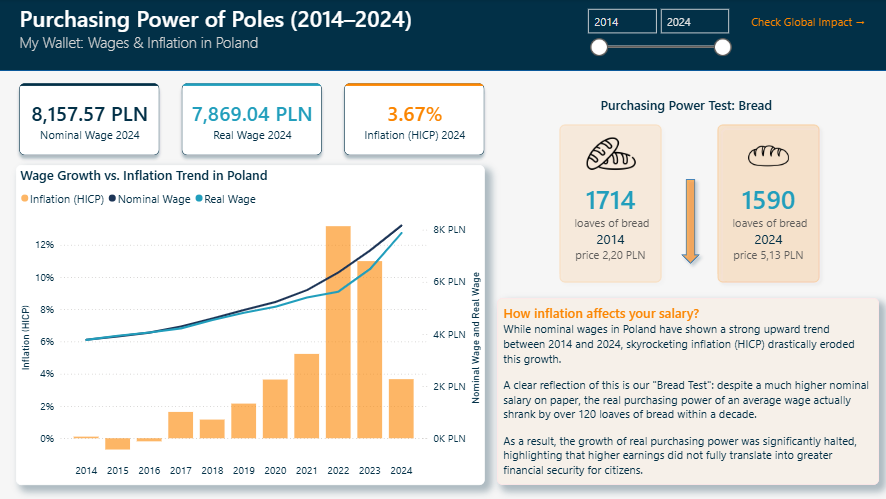
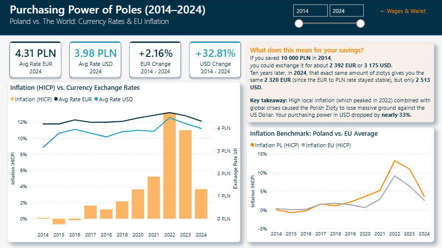

# Purchasing Power of Poles Analysis (2014–2024)
## 📌 Project Overview

The goal of this project was to conduct a comprehensive end-to-end analysis of macroeconomic trends in Poland using multi-source historical datasets from NBP, GUS, and Eurostat. I focused on transforming raw economic data into a structured, interactive dashboard that evaluates the real purchasing power of Polish wages and measures the direct impact of global inflation on citizens' savings.

## 📊 Interactive Dashboard Preview

The video above demonstrates the interactive features of the dashboard. Detailed descriptions of the charts and pages can be found below.

### 📊 Page 1: Wages & Inflation in Poland



This view connects national wage growth with local inflation to uncover the actual change in living standards:
* **The Bread Test:** A custom infographic visualization comparing how many loaves of bread an average salary could buy in 2014 vs. 2024, calculated using real historical price data.
* **Wage vs. Inflation Trend:** A combo chart correlating the sharp rise of Nominal and Real Wages with the HICP Inflation curve over the 10-year period.

### 📊 Page 2: Currency Rates & EU Inflation



This section expands the analysis to a global scale, examining the Polish Zloty's strength and positioning against international standards:
* **Inflation (HICP) vs. Currency Exchange Rates:** A combo chart tracking the average exchange rates of the EUR and USD to evaluate how global crises and domestic inflation influenced the Polish Zloty's value.
* **Global Impact on Savings:** A practical business scenario showing the real-world devaluation of cash savings (e.g., 10,000 PLN) when converted to foreign currencies over the decade.
* **EU Benchmark:** A comparative line chart pitting Poland's HICP inflation directly against the European Union average to highlight local volatility.

## 🛠️ Tech Stack & Tools

* **Power BI Desktop** – Data visualization and report building.
* **Python (Pandas, Requests)** – Automated data extraction via NBP API and end-to-end data cleaning/transformation.
* **Power Query** – Data transformation.
* **DAX (Data Analysis Expressions)** – Created calculated measures.
* **GitHub** – Documentation, version control, and project hosting.

## ⚙️ Data Pipeline & ETL Process

Before building the dashboard, I developed a three-stage data pipeline in Python to automate data ingestion, validate data quality, and transform multi-source datasets into an analytics-ready format:

1. **Extraction (`exchange_rates.py`):** Built a script utilizing the Python `requests` library to fetch historical exchange rates directly from the National Bank of Poland (NBP) API.
2. **Validation (`data_check.py`):** Developed a script to perform exploratory data analysis (EDA), detect missing values, and inspect data structures from various sources (GUS, Eurostat) before transformation.
3. **Transformation (`data_cleaning.py`):** Used `pandas` to clean raw data, filter and select specific columns required for analysis, and translate Polish source headers into English for a standardized schema. I also aligned and standardized date/year formats across all distinct datasets to ensure seamless relationship mapping and star-schema integration inside Power BI, before exporting them as clean, individual CSV files.

*The complete Python code and automated data workflow can be found in the `/data-pipeline` directory, with datasets organized into raw and processed folders.*

## 💡 Key Insights

## 🛠️ Key DAX Measures

| Measure Name | Description |
| :--- | :--- |
| **Avg Rate EUR** | Calculates the average Euro (EUR) exchange rate dynamically based on the selected timeline filter. |
| **Avg Rate EUR 2024** | Isolates and calculates the fixed average EUR exchange rate for the final benchmark year (2024), ignoring user timeline filters. |
| **Avg Rate USD** | Calculates the average US Dollar (USD) exchange rate dynamically based on the selected timeline filter. |
| **Avg Rate USD 2024** | Isolates and calculates the fixed average USD exchange rate for the final benchmark year (2024), ignoring user timeline filters. |
| **EUR Change Pct** | Measures the percentage growth or decline of the EUR exchange rate across the user-selected timeframe. |
| **USD Change Pct** | Measures the percentage growth or decline of the USD exchange rate across the user-selected timeframe. |
| **EUR Growth Subtitle** | Generates a dynamic, time-aware text string for the EUR KPI card subtitle (e.g., *"EUR Change 2014 - 2024"*). |
| **USD Growth Subtitle** | Generates a dynamic, time-aware text string for the USD KPI card subtitle (e.g., *"USD Change 2014 - 2024"*). |
| **Inflation PL (HICP)** | Calculates the dynamic Harmonised Index of Consumer Prices (HICP) for Poland based on the active slicer selection. |
| **Inflation EU (HICP)** | Calculates the dynamic Harmonised Index of Consumer Prices (HICP) for the European Union as a baseline benchmark. |
| **Latest Inflation PL (HICP)** | Extracts the inflation rate for the final year. |
| **Nominal Wage** | Calculates the average gross monthly wage in Poland dynamically over the selected time range. |
| **Real Wage** | Adjusts the nominal wage against inflation metrics to calculate the true purchasing power over time. |
| **Latest Nominal Wage** | Extracts the most recent nominal wage value. |
| **Latest Real Wage** | Extracts the most recent real wage value. |

<details>
<summary><b>🔍 View DAX Code: Real Wage Calculation </b></summary>
<br>

This measure calculates the real purchasing power of wages by adjusting the nominal wage for inflation (using the HICP index). It divides the nominal wage by (1 + Inflation Rate) to show whether people actually grew wealthier over time, or if their raises were simply eaten up by inflation.

```dax
Real Wage = 
VAR CurrentNominalWage = [Nominal Wage]
VAR InflationRate = [Inflation PL (HICP)]
RETURN
DIVIDE(CurrentNominalWage, 1 + InflationRate)
```
</details>

<details>
<summary><b>🔍 View DAX Code: Latest Inflation PL (HICP) Calculation </b></summary>
<br>

This measure ensures the KPI card always shows the inflation rate for the final year (2024), regardless of what the user selects on the date slicer. Instead of disabling visual interactions in Power BI, the DAX code handles it dynamically: the `VAR` block fetches the maximum year directly from the GUS data table, and `CALCULATE` forces this specific year into the filter context.

```dax
Latest Inflation PL (HICP) = 
VAR MaxYear = MAX('poland_wages_gus_clean'[year]) 
RETURN
CALCULATE(
    [Inflation PL (HICP)],
    'Calendar'[year] = MaxYear
)
```
</details>

<details>
<summary><b>🔍 View DAX Code: EUR Change Pct Calculation </b></summary>
<br>

This measure calculates the percentage change in the Euro exchange rate across the years selected on the slicer. It identifies the exact starting and ending points (`year_month`) from the current filter context to compute an accurate delta.

```dax
EUR Change Pct = 
VAR MinMonth = MIN('Calendar'[year_month])
VAR MaxMonth = MAX('Calendar'[year_month])

VAR RateStart = 
    CALCULATE(
        AVERAGE(fx_rates_clean[avg_rate]),
        fx_rates_clean[currency] = "EUR",
        'Calendar'[year_month] = MinMonth
    )

VAR RateEnd = 
    CALCULATE(
        AVERAGE(fx_rates_clean[avg_rate]),
        fx_rates_clean[currency] = "EUR",
        'Calendar'[year_month] = MaxMonth
    )

RETURN
    DIVIDE(RateEnd - RateStart, RateStart)
```
</details>
